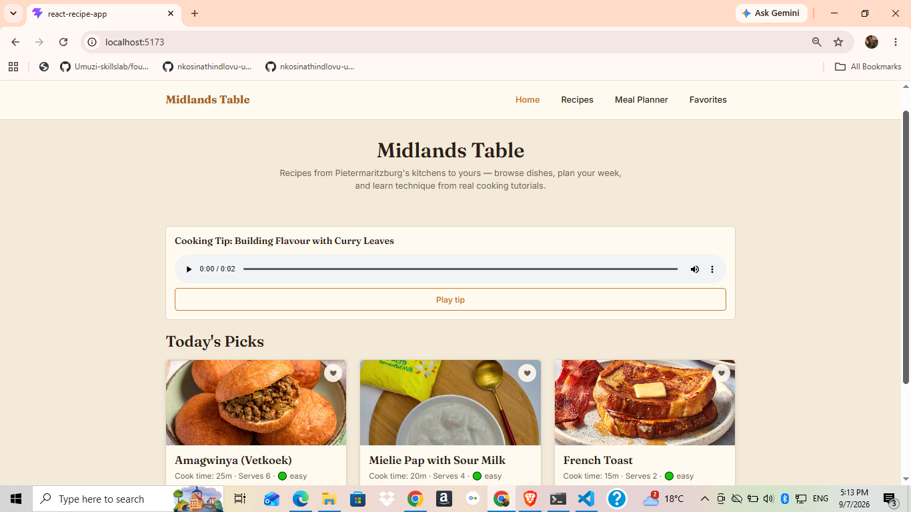
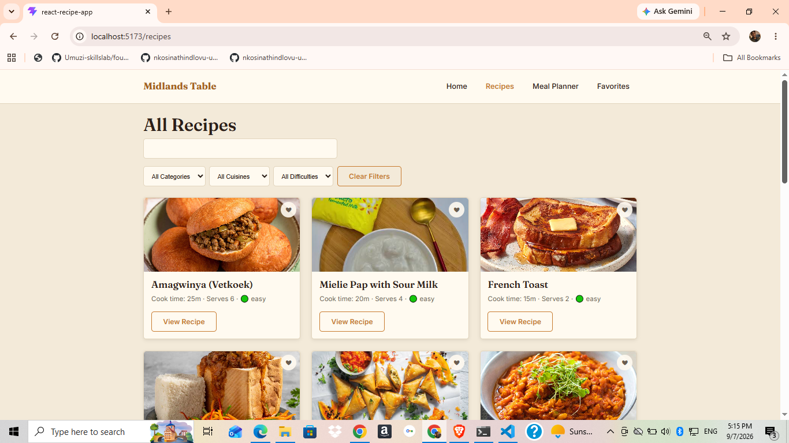
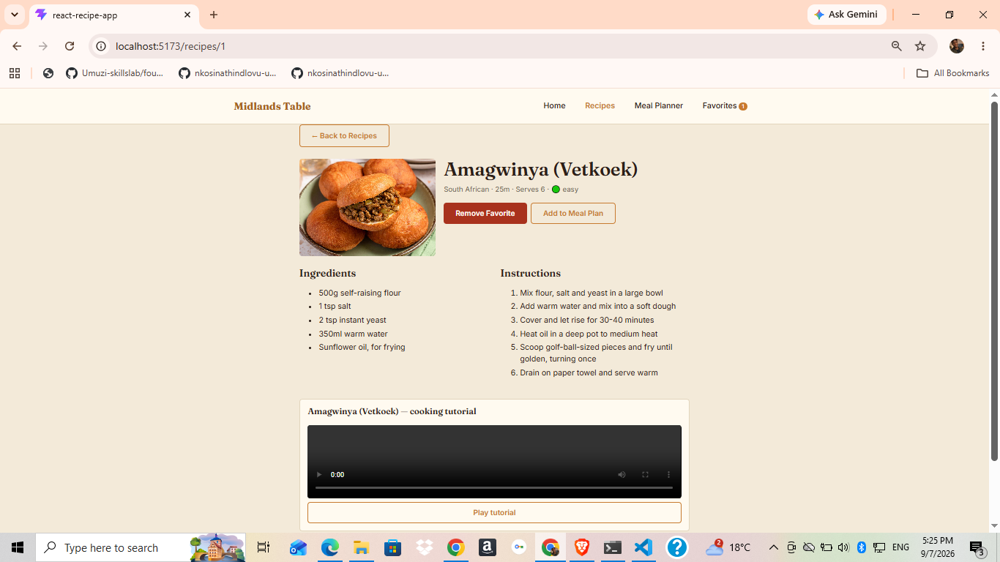
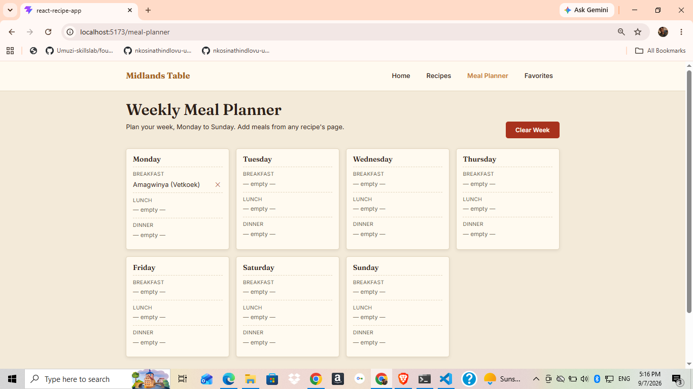
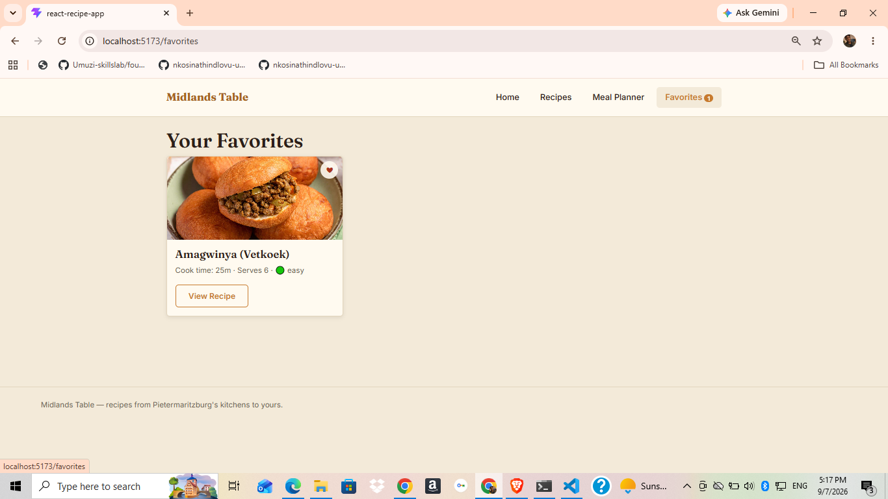
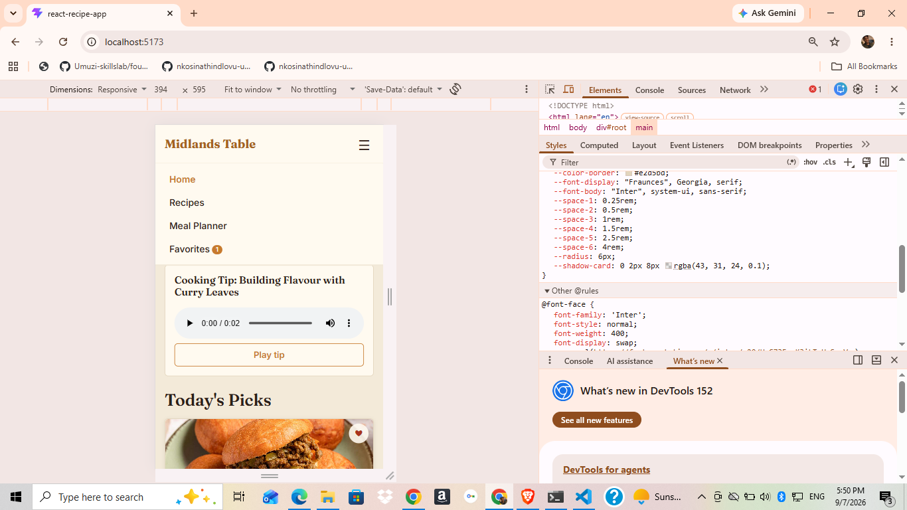

# Midlands Table

A recipe discovery and weekly meal-planning app built with React. Built for a fictional
Pietermaritzburg cooking school that partners with local food bloggers — browse recipes,
watch cooking tutorials, plan your week, and save favorites.

## Features

- Browse and search recipes by title, with dropdown filters for category, cuisine, and difficulty
- Full recipe detail pages with ingredients, step-by-step instructions, and an embedded
  cooking tutorial video (with real play/pause controls)
- A cooking-tips audio guide on the Home page
- Favorite/unfavorite any recipe, persisted across browser sessions
- A Monday–Sunday meal planner with breakfast/lunch/dinner slots per day, also persisted
  across sessions
- Responsive navigation with a mobile hamburger menu and active-route highlighting
- A custom 404 page for unmatched routes

## Technologies Used

- React 19 (functional components + hooks only, no class components)
- React Router DOM (routing, dynamic routes, programmatic navigation)
- PropTypes (prop validation)
- CSS Modules (scoped component styling) + plain CSS custom properties for design tokens
- Vite (build tooling)
- Browser `localStorage` (persistence)

## Component Architecture

Components are organized by responsibility under `src/components/`:

- **UI/** — generic, reusable building blocks: `Button`, `Card`, `SearchBar`, `Loading`, `Modal`
- **Media/** — `VideoPlayer` and `AudioPlayer`, both wrapping native HTML5 media elements
- **Navigation/** — `Navbar`, with active-route styling and a mobile menu
- **Recipe/** — `RecipeCard`, `RecipeList`, `RecipeFilter`, `RecipeDetail`
- **MealPlanner/** — `MealPlanner` (container) and `DayCard` (reused 7x for Mon-Sun)
- **common/** — `Footer`, `EmptyState`

Route-level screens live in `src/pages/`: `Home`, `RecipesPage`, `MealPlannerPage`,
`FavoritesPage`, `NotFound`.

See `planning/PLANNING.md` for the full component hierarchy and data-flow diagrams.

## Installation

```bash
npm install
npm run dev
```

Then open the local URL Vite prints (typically `http://localhost:5173`).

## Project Structure

```
recipe-app/
|-- public/assets/        images, videos, audio used by recipes
|-- src/
|   |-- components/       organized by feature (UI, Media, Navigation, Recipe, MealPlanner, common)
|   |-- pages/            one file per route
|   |-- data/             recipesData.js -- the recipe "database"
|   |-- utils/            helpers.js -- formatting/filtering functions
|   |-- App.jsx           top-level state + routing
|   `-- main.jsx          React entry point
|-- planning/             planning document (component hierarchy, data flow, state strategy)
`-- screenshots/          app screenshots referenced below
```

## Component Descriptions

- `RecipeCard` -- one recipe's summary (image, title, cook time, difficulty, favorite button)
- `RecipeList` -- maps an array of recipes into `RecipeCard`s, or shows an empty state
- `RecipeDetail` -- full recipe page reached via the dynamic route `/recipes/:id`; includes
  the video tutorial and a modal for adding the recipe to the meal plan
- `MealPlanner`/`DayCard` -- the 7-day planner grid; `DayCard` is one reusable component
  rendered once per day
- `Navbar` -- top navigation; shows a badge with the current favorites count

## State Management

Top-level state (`recipes`, `favorites`, `mealPlan`, `isLoading`, `error`) lives in `App.jsx`
and is passed down to pages as props -- this is "lifting state up," since multiple pages
(Recipes, Favorites, Meal Planner, Recipe Detail) all need to read or update the same data.
Local UI state (search term, active filters) stays inside the page that needs it
(`RecipesPage`), since nothing else in the app needs to know about it.

Four `useEffect` hooks handle: loading the recipe data on mount, reading favorites and the
meal plan from `localStorage` on mount, and writing both back to `localStorage` whenever
they change -- so favorites and the meal plan survive a page refresh or browser restart.

## Routing

| Route | Page |
|---|---|
| `/` | Home |
| `/recipes` | RecipesPage |
| `/recipes/:id` | RecipeDetail (dynamic route) |
| `/meal-planner` | MealPlannerPage |
| `/favorites` | FavoritesPage |
| `*` | NotFound (404) |

## Future Enhancements

- Swap placeholder photography for original dish photography and tutorial footage
- Drag-and-drop reordering in the meal planner
- A "generate shopping list" feature derived from the week's planned meals
- User accounts, so favorites/meal plans sync across devices instead of just one browser

## Screenshots







